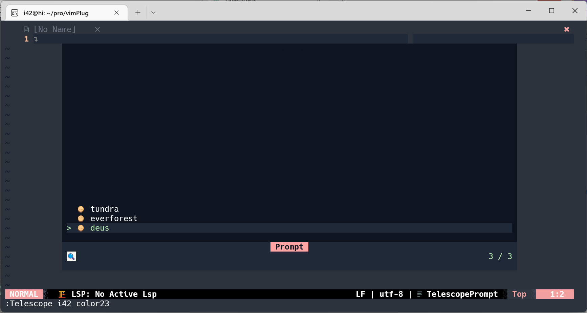

<!-- https://fsymbols.com/ -->
```

░░██╗██╗██████╗░░░░░░░░█████╗░░█████╗░██╗░░░░░░█████╗░██████╗░
░██╔╝██║╚════██╗░░░░░░██╔══██╗██╔══██╗██║░░░░░██╔══██╗██╔══██╗
██╔╝░██║░░███╔═╝█████╗██║░░╚═╝██║░░██║██║░░░░░██║░░██║██████╔╝
███████║██╔══╝░░╚════╝██║░░██╗██║░░██║██║░░░░░██║░░██║██╔══██╗
╚════██║███████╗░░░░░░╚█████╔╝╚█████╔╝███████╗╚█████╔╝██║░░██║
░░░░░╚═╝╚══════╝░░░░░░░╚════╝░░╚════╝░╚══════╝░╚════╝░╚═╝░░╚═╝
```

---

42-color is colorscheme selector for [my-nvim64](https://github.com/HUAHUAI23/nvim64) ,which contains three colorschemes, deus tundra and everforest

## Requirements

---

- Neovim (v0.7.0) or the latest neovim nightly commit is required for telescope.nvim to work.
- telescope

## How to use

---

1. install 42-color with packer or some other neovim plugins manager.
2. use command `:Telescope i42 color23` to invoke colorscheme list and select the one you want.

---

## demo


